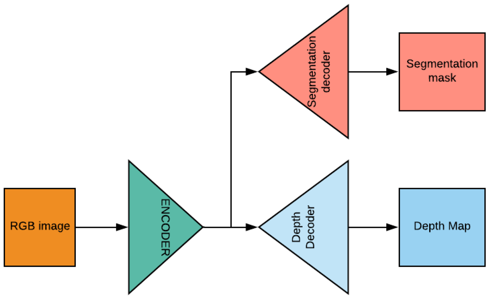
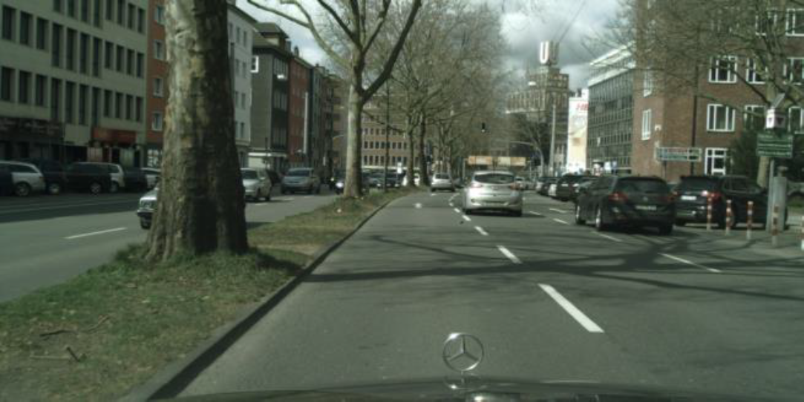
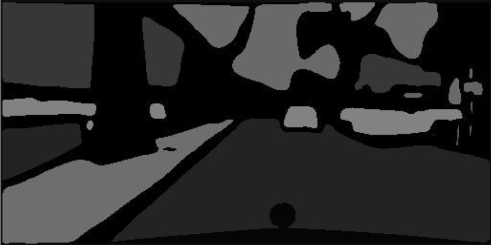
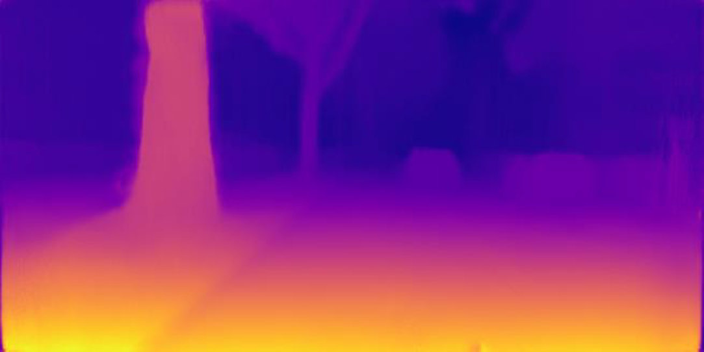

# Introduction
Our project addresses the two most important task in computer vision of depth estimation and semantic segmentation. Generally, both the tasks are addresses separately, but we have considered the idea of integrating both the task together in the same framework as they may benefit each other in improving the accuracy. We have integrated both the depth estimation network and the semantic segmentation network together into a single convolutional network. The main goal is to keep best features of both the networks and getting better results without compromising accuracy. Qualitative and quantitative experiments demonstrate that the performance of our methodology outperforms the state of the art on single-task approaches, while obtaining competitive results compared with other multi-task methods.

# Architecture

# Evaluation Matrix
The primary aim of our project was to verify that different applications of visual learning share the same low level features, so for evaluation we initialize the shared encoder and the depth decoder with the pre trained weights given by the author which generates state of the art results compared to other depth estimation methods. For validating the segmentation pipeline, we use the trained segmentation decoder and calculate the meanIOU over the test set of 3475 ground truth images.
One of the significant results that we achieved was on the car segmentation class where the IOU was 0.68 which is an encouraging result to explore more of such hybrid networks. Some of the other class such as motorcycle, truck, traffic signs get low score of IOU, we believe that the such poor results occur because much significant information is lost in the coarse annotation of ground truth labels which leads to poor detection of these less occurring or small classes.

# Results

## Original Image

## Segmentation Mask

## Depth Map

